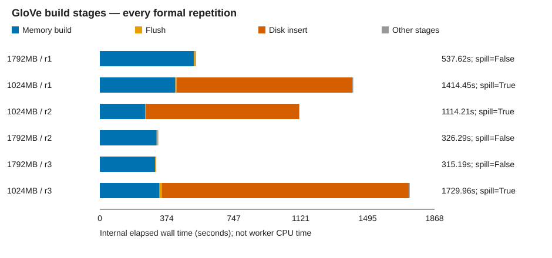
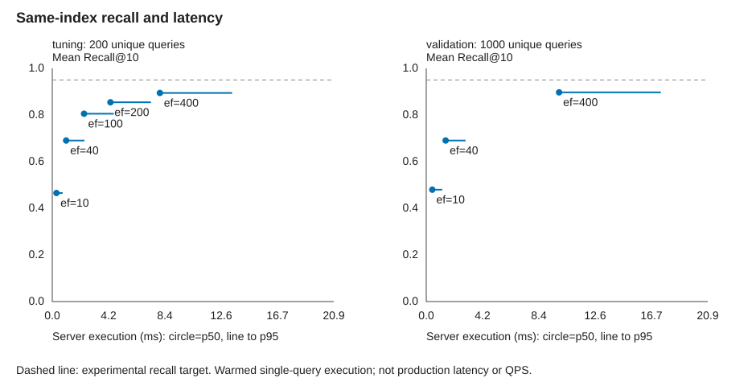

# GloVe 真实向量诊断案例

## 构建内存对照

同一份数据、固定 m=16/ef_construction=64 和实际并行度；正常运行镜像，不固定随机图拓扑。
图展示全部正式重复的内部时间，表展示完整构建命令的中位数与范围。

| 内存预算 | 重复 | 构建中位数 s | 范围 s | spill 次数 | 容器近似峰值中位数 MiB |
|---|---:|---:|---|---:|---:|
| 1792MB | 3 | 326.571 | 315.599–538.041 | 0 | 3580.7 |
| 1024MB | 3 | 1414.649 | 1114.468–1730.185 | 3 | 2781.1 |

容器峰值含数据库与缓存，不是 HNSW 私有内存。内存预算改善与 C 补丁提速是不同问题。
只有减少 spill 同时呈现可重复的时间收益，才支持本任务增加内存；范围重叠不构成等价证明。

召回案例使用 `20260909T145555Z-glove-formal-high-r3` 构建的单个索引。

## GloVe 同索引召回验证

- 调参集选出的最小达标 ef_search：`None`。不是业务最优保证。
- 验证集不参与选参；0.95 等目标是实验口径，非官方标准。
- 严格 ID 重合 Recall@10；重复计时不增加独立查询数。
- 每次计时前执行同一查询取得结果；随机化配置/查询/重复顺序。耗时为暖缓存服务器执行时间，不是业务端到端延迟。

| 查询集 | ef_search | 独立查询数 | 平均 Recall@10 | p50 ms | p95 ms | 低于目标 |
|---|---:|---:|---:|---:|---:|---|
| tuning | 10 | 200 | 0.4655 | 0.309 | 0.770 | True |
| tuning | 40 | 200 | 0.6905 | 1.031 | 2.397 | True |
| tuning | 100 | 200 | 0.8055 | 2.363 | 4.576 | True |
| tuning | 200 | 200 | 0.8545 | 4.324 | 7.332 | True |
| tuning | 400 | 200 | 0.8945 | 7.999 | 13.375 | True |
| validation | 10 | 1000 | 0.4798 | 0.449 | 1.189 | True |
| validation | 40 | 1000 | 0.6906 | 1.443 | 2.924 | True |
| validation | 400 | 1000 | 0.8971 | 9.876 | 17.440 | True |

提高 ef_search 的收益与成本属于参数调整，不是 C 补丁的算法加速。
若独立验证未达标或延迟代价不可接受，本轮不自动重建/继续扩大参数搜索。

## 范围与复现证据

- GloVe 是公开词向量评测数据，不是 OpenTenBase 指定数据或真实业务查询。
- 本轮没有改动 C 补丁，没有评估 RAG 答案质量或生产并发吞吐。
- 调参/验证查询不重叠；目标阈值为本轮协议；验证结果不回流选参。
- 原始失败与预检不混入下列正式重复；查询中断保留已完成的逐条证据。

- [20260909T135759Z-glove-formal-high-r1](../20260909T135759Z-glove-formal-high-r1/summary.json)
- [20260909T140726Z-glove-formal-low-r1](../20260909T140726Z-glove-formal-low-r1/summary.json)
- [20260909T143123Z-glove-formal-low-r2](../20260909T143123Z-glove-formal-low-r2/summary.json)
- [20260909T145015Z-glove-formal-high-r2](../20260909T145015Z-glove-formal-high-r2/summary.json)
- [20260909T145555Z-glove-formal-high-r3](../20260909T145555Z-glove-formal-high-r3/summary.json)
- [20260909T150617Z-glove-formal-low-r3](../20260909T150617Z-glove-formal-low-r3/summary.json)
