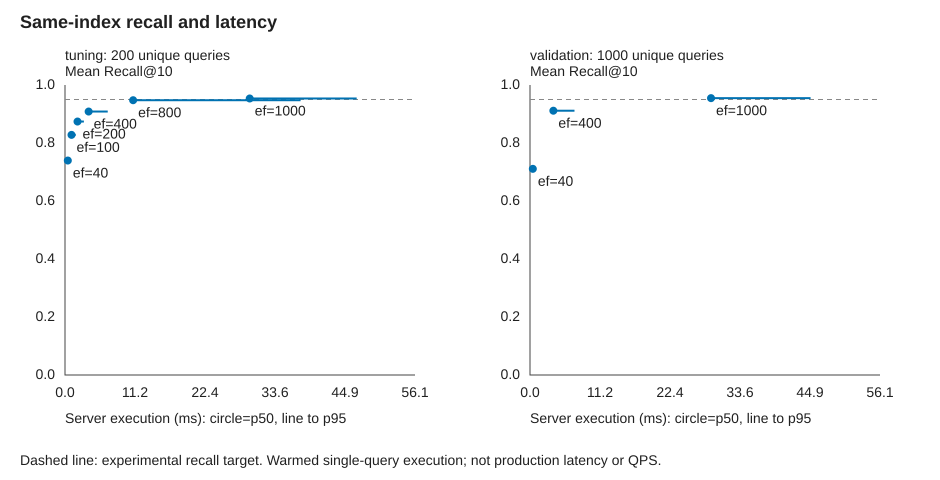

# GloVe 有限召回改进：独立的新一轮

- 流程状态：passed
- 选中配置：`{'m': 16, 'ef_construction': 128, 'ef_search': 1000, 'source': 'm16-efc128'}`
- 独立验证达到目标：`True`

旧轮次没有被改写；新图拓扑与旧索引不同。本轮按调参选择，不按验证集继续搜索。

| m / ef_construction | 构建 s | 索引 MiB | 容器峰值 MiB | spill | 调参最高平均 Recall@10 |
|---|---:|---:|---:|---|---:|
| 16 / 64 | 151.284 | 840.6 | 3573.4 | False | 0.9315 |
| 16 / 128 | 249.894 | 840.6 | 3538.6 | False | 0.9535 |

## GloVe 同索引召回验证

- 调参集选出的最小达标 ef_search：`1000`。不是业务最优保证。
- 验证集不参与选参；0.95 等目标是实验口径，非官方标准。
- 严格 ID 重合 Recall@10；重复计时不增加独立查询数。
- 每次计时前执行同一查询取得结果；随机化配置/查询/重复顺序。耗时为暖缓存服务器执行时间，不是业务端到端延迟。

| 查询集 | ef_search | 独立查询数 | 平均 Recall@10 | p50 ms | p95 ms | 低于目标 |
|---|---:|---:|---:|---:|---:|---|
| tuning | 40 | 200 | 0.7395 | 0.453 | 0.830 | True |
| tuning | 100 | 200 | 0.8280 | 1.042 | 1.710 | True |
| tuning | 200 | 200 | 0.8740 | 2.005 | 3.025 | True |
| tuning | 400 | 200 | 0.9085 | 3.787 | 6.846 | True |
| tuning | 800 | 200 | 0.9475 | 10.912 | 37.737 | True |
| tuning | 1000 | 200 | 0.9535 | 29.589 | 46.721 | False |
| validation | 40 | 1000 | 0.7109 | 0.453 | 0.842 | True |
| validation | 400 | 1000 | 0.9113 | 3.740 | 7.127 | True |
| validation | 1000 | 1000 | 0.9547 | 28.998 | 44.945 | False |

提高 ef_search 的收益与成本属于参数调整，不是 C 补丁的算法加速。
若独立验证未达标或延迟代价不可接受，本轮不自动重建/继续扩大参数搜索。

- 构建成本每配置仅一次，不据此声称稳定的构建加速或普适最佳参数。
- 查询三次重复不增加独立样本数；暖缓存服务器执行时间不是端到端延迟或 QPS。
- 参数调整收益不是 C 补丁算法加速；达到平均目标不意味着每个查询都达标。
- 未给出业务延迟预算，因此结果只展示代价，不认定满足真实业务 SLA。
- 所有被采用构建、调参与验证的原始记录保存在本目录；预检单独保存。
